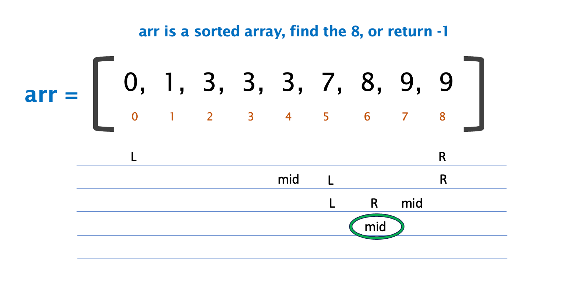
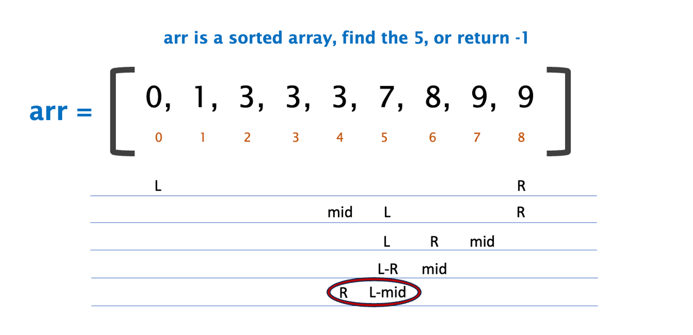
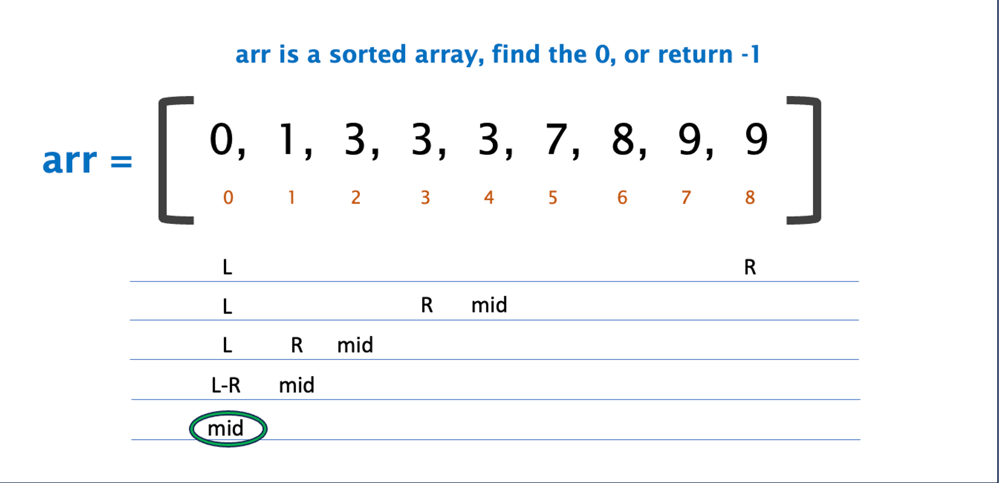
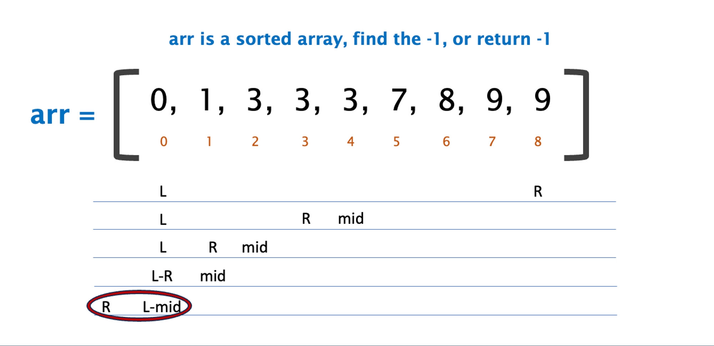

# Binary Search

Also known as half-interval search or logarithmic search, is a search algorithm that finds the position of a target value within a sorted array. Binary search compares the target value to the middle element of the array.

## Complexity

* **Time: O(log(n))**
    * You are dividing it in half every time, therefor it is logarithmic
* **Space Complexity: O(1) or O(log(n))**
    * **Iterative: O(1)**
        * If you are using a loop, it has a space complexity of O(1)
    * **Recursive: O(log(n))**
        * If you are recursively splitting your set, the space complexity will match the time complexity.

## Logic

Suppose you have a sorted array and want to find an element in the array of length n. You could start at 0 and traverse the array to n-1, stopping when you find the element. This would be the simplest approach and have a complexity of O(n).

A more efficient approach would be to 

1. Define the ends, 
2. Check the middle
3. Make the middle a new end
4. Check the new middle
5. Make the middle a new end
6. … until you find the element for which you are looking. 

Because you are bisecting for each search, this search complexity will be logarithmic, O(log(n)).

<p align="center">
  
</p>


## Pseudocode/Code

### Find an 8, return -1 if not present

Iterative

```jsx
/**
left = 0
right = arr.length-1

while(true)
	if left > right, return -1

	middle = Math.ceil((right+left)/2)
	if(arr[middle] === 8), return middle

	else if(arr[middle] < 8), left = middle + 1 
	else right = middle - 1
*/

const arr = [0,  1,  3,  3,  3,  7,  8,  9,  9]

const binarySearch = (arr, n) => {
  let left = 0;
  let right = arr.length-1;
  
  while(true){
    if(left>right) return -1

    const middle = Math.ceil((right+left)/2)
    if(arr[middle] === n) return middle

    if(arr[middle] < n) left = middle + 1
    else right = middle - 1
  }
}

console.log(binarySearch(arr, 8))//6
console.log(binarySearch(arr, 0))//0
console.log(binarySearch(arr, 9))//7 or 8
console.log(binarySearch(arr, 1))//1
console.log(binarySearch(arr, 7))//5
console.log(binarySearch(arr, 4))//-1
console.log(binarySearch(arr, 5))//-1
console.log(binarySearch(arr, -1))//-1
console.log(binarySearch(arr, 10))//-1
```

Recursive

```jsx
/**

left = 0
right = arr.length-1

helper(l, r){

	if l > r, return -1
	
	middle = Math.ceil((l+r)/2)

	base case
		if arr[middle] === 8, return middle

	recursive case
		if arr[middle] < 8, return helper(middle+1, r)
		else return helper(l, middle-1)

return helper(l, r)
			
*/

const arr = [0,  1,  3,  3,  3,  7,  8,  9,  9]

const binarySearch = (arr, n) => {
	const left = 0;
	const right = arr.length-1;
  
  const helper = (l, r) => {
    //number does not exist
    if(l>r) return -1

    //base case
    const middle = Math.ceil((l+r)/2);
    if(arr[middle] === n) return middle

    //recursive cases
    else if(arr[middle] < n) return helper(middle + 1, r)
    else return helper(l, middle - 1)
  }

  return helper(left, right)
}

console.log(binarySearch(arr, 8))//6
console.log(binarySearch(arr, 0))//0
console.log(binarySearch(arr, 9))//7 or 8
console.log(binarySearch(arr, 1))//1
console.log(binarySearch(arr, 7))//5
console.log(binarySearch(arr, 4))//-1
console.log(binarySearch(arr, 5))//-1
console.log(binarySearch(arr, -1))//-1
console.log(binarySearch(arr, 10))//-1
```

### Find the first 3

```jsx

```

### Find the closest number to 5, round up if equidistant

```jsx

```

## Examples

> Let arr = [0, 1, 3, 3, 3, 7, 8, 9, 9]
> 
- Find 8, search value is present
    
<p align="center">
    
</p>
    
- Find 5, search value is not present
    
<p align="center">
    
</p>
    
- Find 0, search value is boundary
    
<p align="center">
    
</p>
    
- Find -1, search value out of bounds
    
<p align="center">
    
</p>